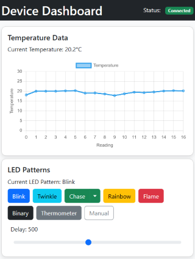

# COM3505-IOT Assignment

<!-- ^ Crunchy image -->
<!-- Maybe a picture of the board too -->

## Client
<!-- TODO: Layout, Setup -->

## Server
### Setup
Create a virtual environment:
```bash
python -m venv .venv
```

Once your venv is created, you can activate it by running the following command:

```sh
source .venv/bin/activate # On Linux/Mac
```

```powershell
.venv\Scripts\Activate # On Windows
```

Install Flask
```
pip install Flask
```

Run the Flask Server
```
flask --app .\Server\server.py run --host=0.0.0.0
```

Visit the Dashboard

http://127.0.0.1:5000

### Routes

#### GET '/'
The Dashboard. Used to view the live temperature readings on a graph and send LED commands. Employs a mobile first design.

#### POST '/api/led'
Updating the LED commands. Requires a json object:
```bash
{
  "mode": "b", # valid pattern code
  "pattern": 0, # 0 - 4095
  "delay": 500 # 100 - 1000
}
```

#### POST '/api/data'
The designated route for the ESP32 to send temperature readings using this JSON format: 
```bash
{
  "temperature": 23.1
}
```
The server attaches its own incrementing 'label' value to each data packet for when it is displayed on the graph.

#### GET '/api/data'
The AJAX route for the dashboard and graph to get the most recent readings.
Returns the most recent 150 readings as a JSON object.

## Contributors
- Edouard Levasseur (Client)
- Max Manning (Server)